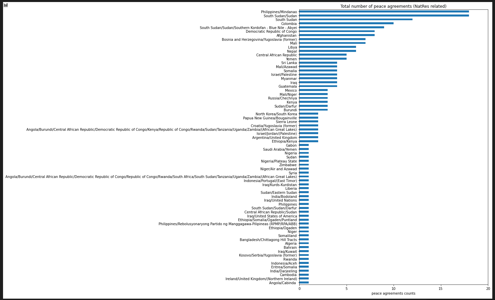
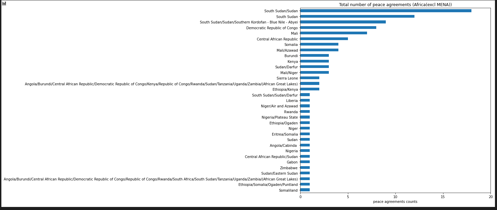

# Assignment 3 

My part of the assignment 3 is to analyze the connection between border issues and natural resource issues according to the "peace agreement.xlsx" by histogram.

## Step 1 

* Filter the natural resource related agreements out.
* Show it by country with peace agreement counts.

The result is shown as follow:

## Step 2 Africa(excl MENA)

* Reduce the analysis area to Africa(excl MENA)

* Use the above method to analyze the natural resource related agreements in the new area and draw it.

The result is shown as follow:

(Just the area of Africa(excl MENA))

## Step 3

At then end, by the histogram, we can see that the difference between the origin data of Africa(excl MENA) and the data of natural resource related according to the number of peace agreements.

The result is shown as follow:

